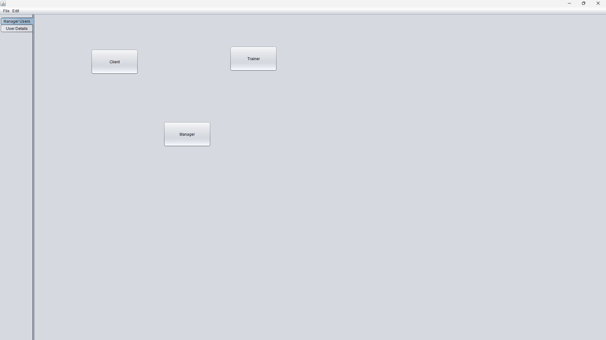
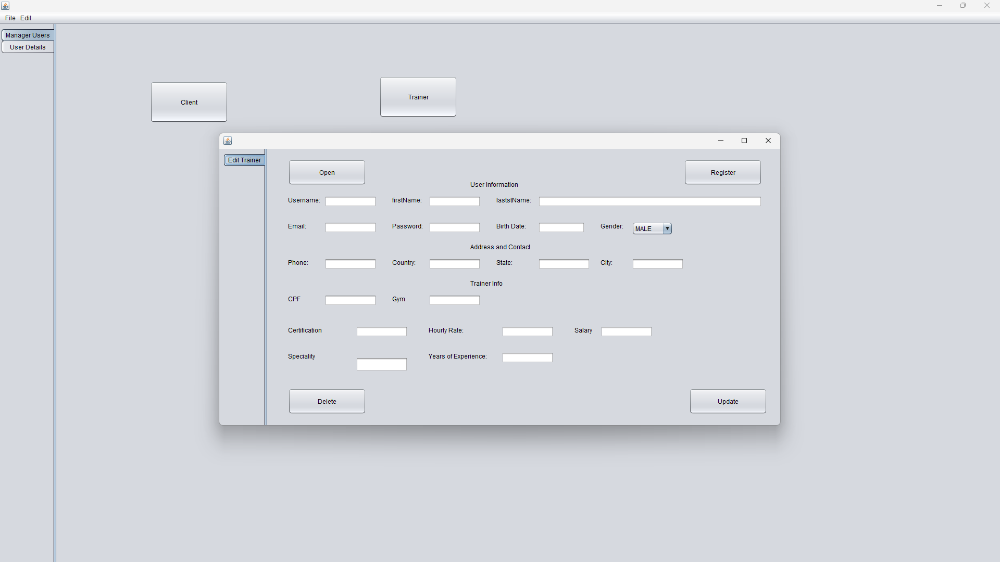
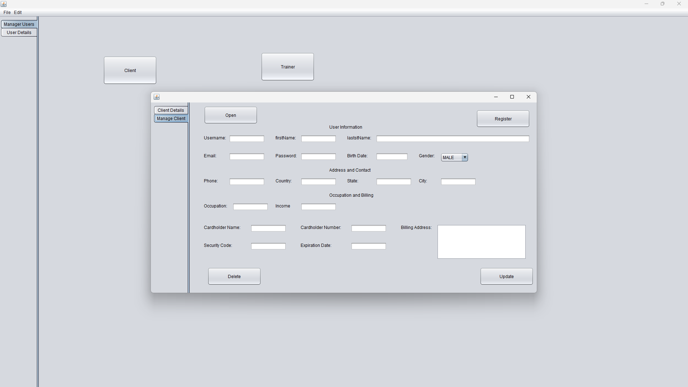
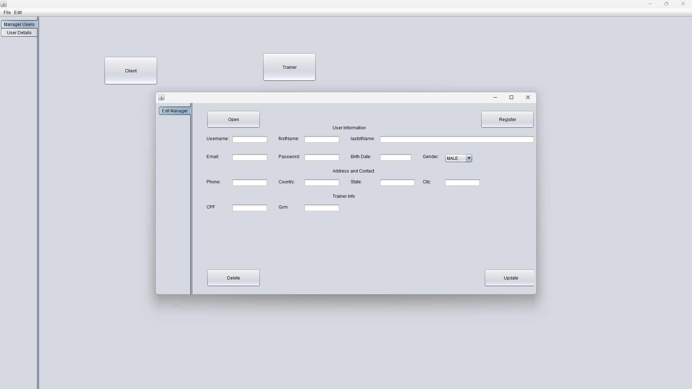

# Fitness Center Management Application

This is a desktop application built in Java for managing fitness center data. The application implements 3 windows for information registration and CRUD operations (Create, Read, Update, and Delete) using 3 distinct data classes. The application follows the MVC (Model-View-Controller) design pattern.

## Project Structure

The project is structured into the following packages:
- `model`: contains the data classes (`Trainer`, `Client`, `Manager`) and the parent class `User`.
- `view`: contains the main class and the 3 windows for data management.
- `controller`: contains the `FileController` interface with the attributes `File archive` and `boolean modified`, and the methods `boolean read()` and `boolean write()`. It also contains the `TextFileController` class that extends `FileController`.
- `resources`: contains the text files generated by the application (`clients.txt`, `managers.txt`, `trainers.txt`).
- `DTO.mappers`: contains the enums for `EGender`, `EPaymentMethod`, and `ERole`.

## File Management

The application allows the user to view and modify the data even after closing and reopening the application. The information is stored in a text file for each data class used (`Trainer`, `Client`, `Manager`). The implementation details are up to the developer as long as CRUD operations and file read/write operations work properly.

## Screenshots

### Main Window

### Trainer Management Window

### Client Management Window

### Manager Management Window

### System Folders

## Usage

1. Clone the repository to your local machine.
2. Create a new  project in your Java IDE.
3. Add the content of the src folder to your src folder in the new project
4. Build and run the application.
5. Use the main window to navigate to the data management windows.
6. Perform CRUD operations as needed.
7. Modify as you want

## Contributing

This project is open for contributions. Please submit a pull request if you would like to contribute.

## License

This project is licensed under the [MIT License](LICENSE).

## Acknowledgements

Special thanks to UTFPR, Prof Fabrício Martins for all the learning.

